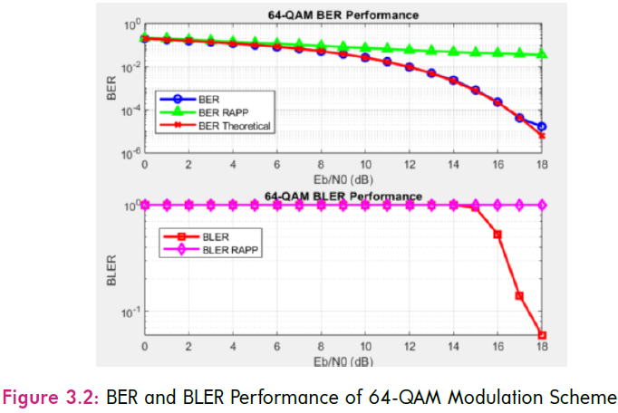

# MATLAB_64_QAM_simulation — 64-QAM over AWGN with RAPP Power Amplifier (PA)

MATLAB project implementing a 64-QAM baseband link simulation over an AWGN channel, with optional nonlinear **RAPP PA** model. The repo includes modulation/demodulation, Gray mapping, BER/BLER evaluation, and supporting analysis utilities (e.g., PSD).

## What’s inside
- 64-QAM modulation/demodulation + Gray mapping
- AWGN channel (Eb/N0 sweep)
- BER / BLER performance curves
- Nonlinear PA using **RAPP** AM/AM characteristic
- Helper analysis functions (PSD, theoretical baselines)

## Repository structure
```text
src/        reusable functions (modulation, PA model, analysis)
scripts/    runnable experiments (BER/BLER sweeps, comparisons)
notebooks/  MATLAB Live Scripts (.mlx)
docs/       PDFs + figures used in this README
resources/  MATLAB project metadata

## Simulation parameters

| Parameter | Value | Description |
|---|---:|---|
| M | 64 | Modulation order (64-QAM) |
| k | log2(64)=6 | Bits per symbol |
| Eb/N0 (dB) | 0–18 | SNR sweep range |
| Number of Symbols | 600 | Symbols per packet |
| Number of Packets (PkNum) | 100 | Packets transmitted |
| Transmit Signal Power (S) | 1 | Normalised transmit power |

### RAPP PA model parameters
| Parameter | Value | Description |
|---|---:|---|
| A0 | 1 | Limiting output amplitude |
| v | 1 | Small-signal gain |
| p | 3 | Smoothness parameter |


## Results
